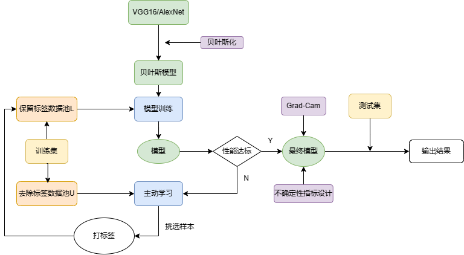
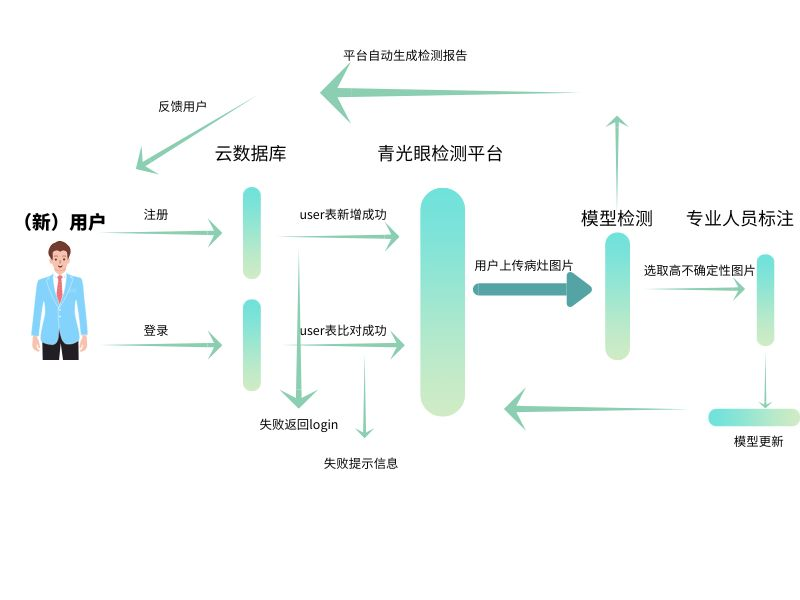
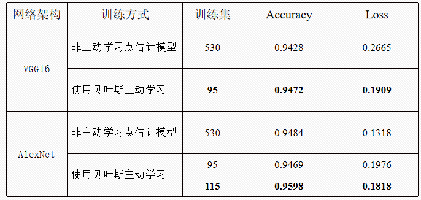
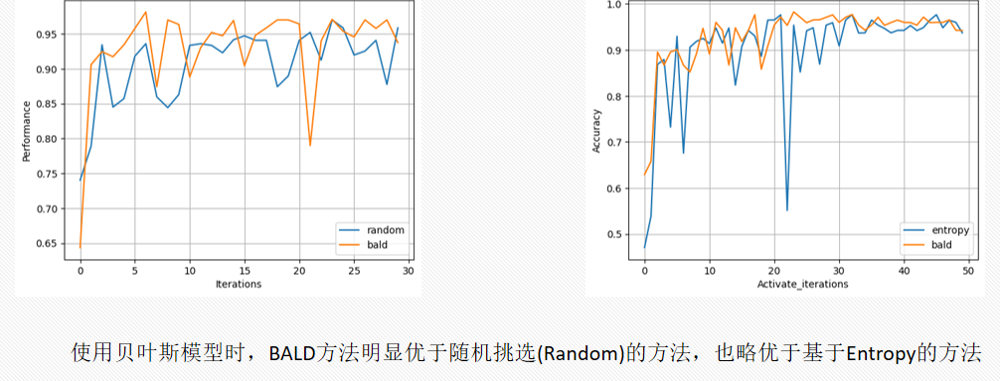
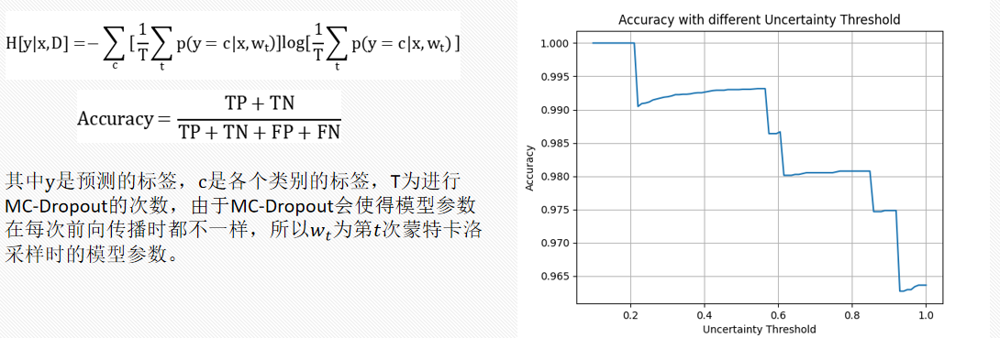
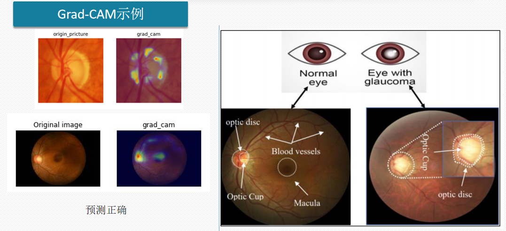
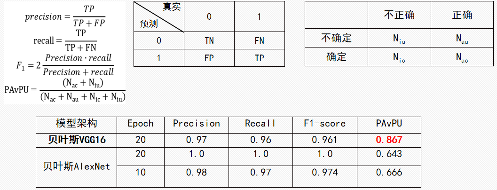
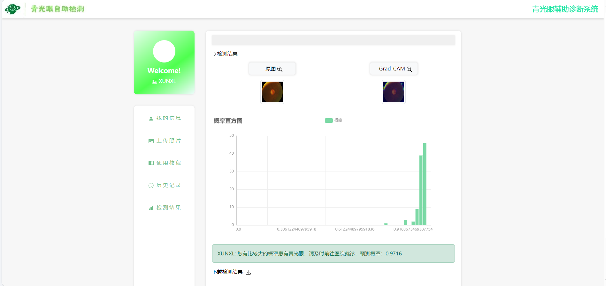

# 项目概述

​	本项目由汕头大学四位学生付、雍、姚、欧贡献完成，大学生创新创业省级立项

- **背景**：据估计，到2040年全球青光眼患者人数将增至1.118亿。根据卫计委2020年的新闻发布会介绍，我国只有4.48万名眼科医生，其中从事眼底医疗服务和研究的医生更少。传统的青光眼诊断仍然依赖于人工诊断，该方法存在着复杂、耗时以及对大量专业人员的需求等局限性。然而，人工智能在医疗领域的应用可以有效缓解这种情况
- **政策**：国务院印发的《“健康中国2030”规划纲要》中明确指出要推动智慧医疗的发展，提高医疗服务水平和效率。《“十四五”国民健康规划》提出优化创新医疗装备审批流程，推动符合条件的人工智能产品进入临床试验，推广应用人工智能。
- **社会价值**：市面上已有便携式眼底彩照照相机，但缺乏一个专门用于青光眼眼底彩照自动检测的公开平台，而这样的平台在患者数量庞大的我国，有着广阔的应用前景与社会意义，有助于偏远地区患者早发现、早治疗。
- **研究现状**：深度学习在医疗领域的应用是一大研究热点，对临床数据进行分析，可以实现疾病风险评估、患者预后预测、个体化治疗方案推荐等，提高了医疗信息的处理效率和准确性。深度学习方法很多都没有应用于高度自动化的疾病监测系统。主要面对两个挑战：模型可解释性和预测结果可信度的问题；训练模型所需的大量标注数据难以获取等等。

# 技术分析

技术栈：vue + flask + ant-design-vue + pytorch

功能：股票查询和股票预测

目的：训练开发能力以及神经网络实际解决问题的能力

## 项目启动

- 技术栈：`js`+ `Django`+ `pytorch` + `Bootstrap`  前端需要node.js环境

- 后端启动命令

```
python manage.py runserver
```

- 数据库迁移

目前项目已经停止维护了，使用的是本地的数据库

```
// 首次启动需要建立数据库和数据表
// 之后如果有数据表的修改操作请执行数据库迁移

// 生成新的迁移文件
python manage.py makemigrations

// 执行迁移
python manage.py migrate
```

## 实现流程图

- 模型训练流程



- 客户端流程



- 项目成果

​	本团队针对模型预测可信度的问题和样本标注成本大的问题，基于改进后的深度学习模型搭建了青光眼诊断辅助平台，实现以下功能：（1）使用贝叶斯主动学习技术选择具有代表性的眼底彩照进行标注、训练，用于更新模型。

（2）支持用户上传眼底彩照，自动检测眼底彩照中是否存在青光眼病变，给出MC-Dropout预测熵作为不确定性评估指标，使用概率直		方图和Grad-CAM类激活图进行可视化，给予更加可靠和可解释的诊断结果，辅助用户进行早期自检;

- 研究结论



- 查询策略对比



- 不确定性评估示例



- Grad-CAM示例



- 模型评价




# 用户预测结果

## 前端部分

- 组件网络请求不稳定：为了网站中所使用的特殊图标和组件能够稳定显示，我们将所有组件的源文件下载下来，牺牲一点内容空间，使得能够在页面中稳定引入；
- 检测功能的监测：由于我们的项目并不是全部采取前后端分离形式，在检测功能的模块是由后端直接用表单接受用户的数据集并且加载进模型，所以在检测结果的展示方面计划采用检测结果生成时间的变化来判断结果的产生，通过ajax提供接口获取方法来获取检测结果的生成时间来进行对比；

- 概率直方图的可视化：采用echart提供的可视化组件来渲染数据，由于该组件的引入使用了国内的镜像地址，所有不用将其源文件加入内存

## 后端部分

- 需要给用户提供注册账号的功能和登录界面；

- 用户凭借已注册的账号登录网站后，网站能够显示用户注册时填写的个人信息；

- 用户登录网站后能够在网站上传眼底彩照，网站能够将上传的彩照传入模型进行预测，并将预测结果输出到前端；

- 网站能够将用户上传的彩照根据不确定性低于和高于经验值分开保存在服务器中；

- 管理员能够通过特定的账号密码进入查看用户上传检测的彩照，并将彩照下载作为数据集使用。

## 预测结果



